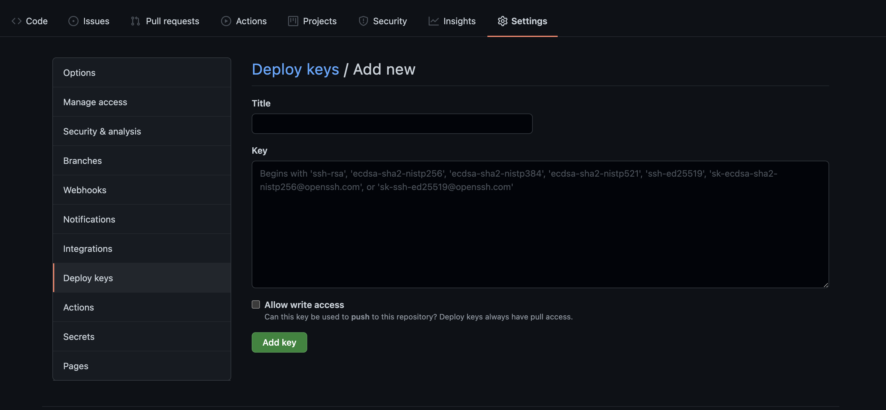

# Docker

### Build project from repositories *privated*

`Step 1:` Generate *github_key* and *github_key.pub*

```bash
ssh-keygen -t rsa -f github_key
```

`Step 2:` Deploy *github_key.pub* on your repositores github

You need copy content in file **github_key.pub** and paste into **key windows**

After, you click **Add Key**



`Step 3:` Edit *Dockerfile*

You can copy content below and paste into your Dockerfile

```docker
COPY github_key .
RUN eval $(ssh-agent) && \
    ssh-add github_key && \
    ssh-keyscan -H github.com >> /etc/ssh/ssh_known_hosts && \
    git clone git@github.com:<username>/<repo name>.git
```