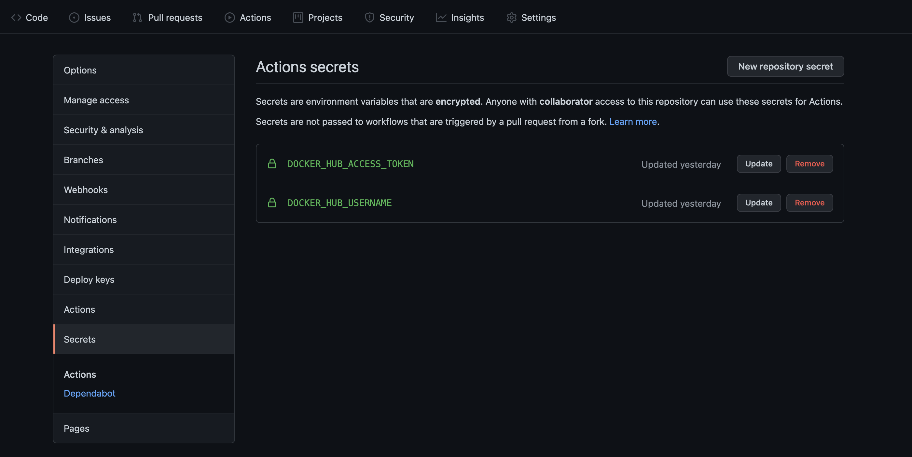

# Docker

### Build project from repositories *privated*

`Step 1:` Generate *github_key* and *github_key.pub*

```bash
ssh-keygen -t rsa -f github_key
```

`Step 2:` Deploy *github_key.pub* on your repositores github

You need copy content in file **github_key.pub** and paste into **key windows**

After, you click **Add Key**


`Step 3:` Edit *Dockerfile*

You can copy content below and paste into your Dockerfile

```docker
COPY github_key .
RUN eval $(ssh-agent) && \
    ssh-add github_key && \
    ssh-keyscan -H github.com >> /etc/ssh/ssh_known_hosts && \
    git clone git@github.com:<username>/<repo name>.git
```

### How to build a CI/CD pipeline with Docker

`Step 1:` Create **New Access Token** in your DockerHub

`Step 2:` In your repositories github, you need create two serects *DOCKER_HUB_USERNAME* and *DOCKER_HUB_ACCESS_TOKEN*

You can access to **Settings** tab



- **DOCKER_HUB_USERNAME** have value is username on DockerHub
- **DOCKER_HUB_ACCESS_TOKEN** have value is access_token  just created 

`Step 2`: Create **Dockerfile** in your project

`Step 3:` Create *New workflow* in actions tab

* ReactJs: [main.yml](./resources/reactjs/docker.yml)

After, you can click **Start commit**

`Step 4`: Check **image** on DockerHub

